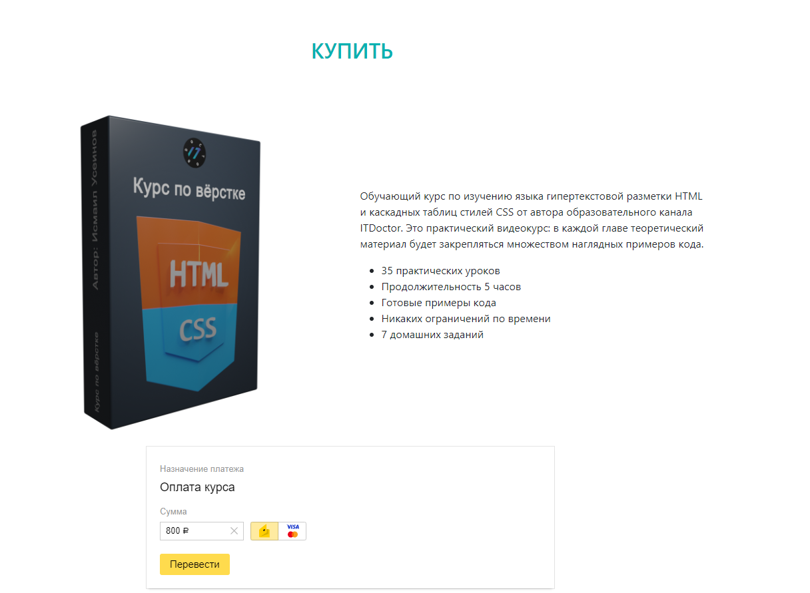
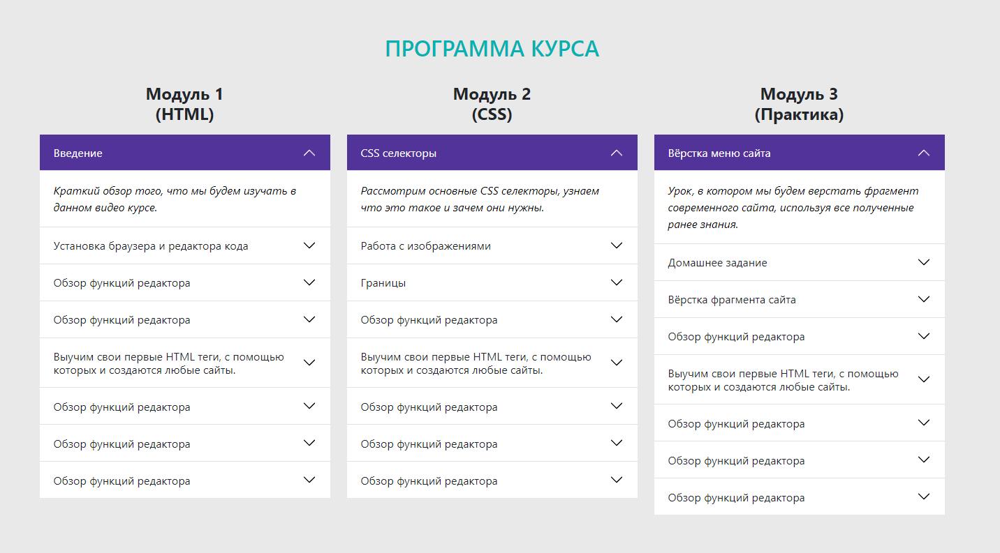

# Демо сайт по уроку ITDoctor

Ссылка на урок на ютубе - [Подробный видео курс по Bootstrap 5 на русском языке, Как создать сайт на Bootstrap 5](https://youtu.be/CvMxvb2D8Iw).

Вёрстка сайта сделана с примером на [странице](https://morphismail.github.io/video_course_basic/#footer). 

>Сайт состоит из одной страницы-лендинга, сделанной с помощью bootstrap 5.
На сайте есть несколько секций, модальное окно, форма оплаты и 3 аккордеона.

Сделала скриншот страницы с помощью Fn+Print Scrin, выделила нужную область, скопировала, вставила ссылку в окно read.me.

Сохранила скриншот в корень проекта. Закомитила в vs code, скопировала название и вставила в код после src="", задала ширину width.

 

Сайт сделан с помощью компонентов [bootstrap 5](https://bootstrap5.ru/docs/content/typography).

Стили css лежат в папке `css`.
Скрипты js лежат в папке `js`.

### В данном видео уроке я научилась
* Подключать стили и скрипты bootstrap в корень проекта с минимальным весом .min
* Подключать иконочный шрифт https://fontello.com/
* делать градиент фона на сайте https://www.colorzilla.com/gradient-editor/
* делать форму оплаты с формой из Юмани https://yoomoney.ru/quickpay/form?_openstat=iget%3Bshop%3Bicon&from=iget
* создать переменные цветов с помощью кода var()
* создавать аккордеон
* задавать свойства иконочному шрифту с помощью style.css
